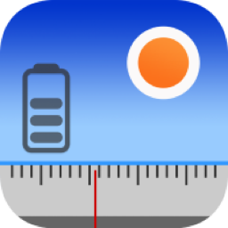
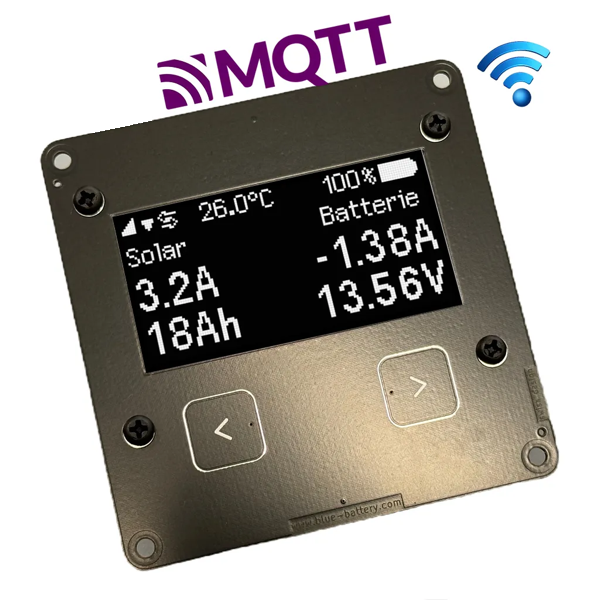
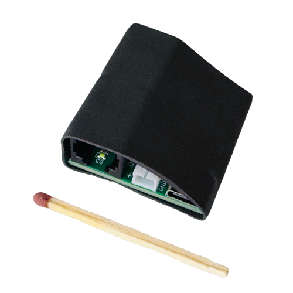
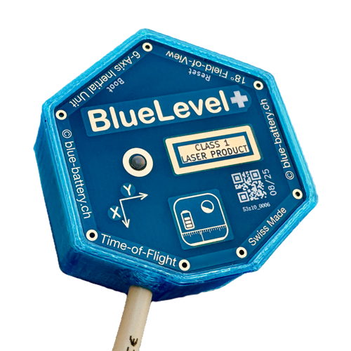
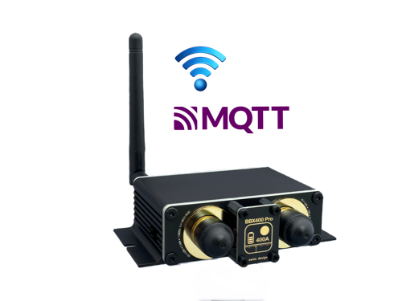
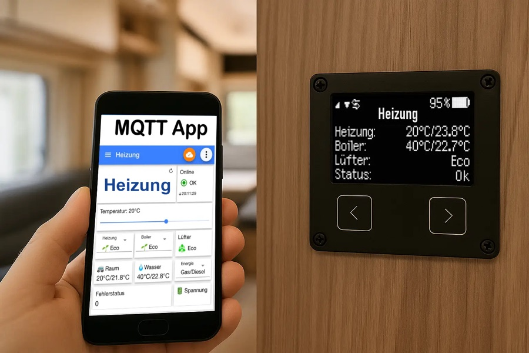

# BlueBattery for Home Assistant

[🇩🇪 Deutsch](README.md) | 🇬🇧 English

<p align="center">
  
  &nbsp;&nbsp;
  
</p>

Home Assistant integration for **[BlueBattery](https://www.blue-battery.com)** devices – battery and solar computers, BB-Display, tank sensors and heater control (Truma/Alde via the TIN adapter) for motorhomes and caravans.

The integration finds BlueBattery devices in your MQTT broker **automatically**, lets you choose which devices to add, and lets you add new devices later – without losing existing entities or their history.

This project is developed by [sahomm](https://github.com/sahomm) in coordination with the BlueBattery developer and with support from Claude (Anthropic).

> **Note:** Private community project, not an official BlueBattery product and **not affiliated with Truma, Alde or any other manufacturer mentioned** – see [Legal notice](#legal-notice). For questions about the devices themselves: [blue-battery.com](https://www.blue-battery.com) and the [BlueBattery forum](https://www.blue-battery.com/groups).

## Contents

- [What is BlueBattery?](#what-is-bluebattery)
- [Features](#features)
- [Supported devices](#supported-devices)
- [Prerequisites](#prerequisites)
- [Step-by-step setup](#step-by-step-setup)
- [Adding devices later](#adding-devices-later)
- [Migrating from the display's built-in Home Assistant support](#migrating-from-the-displays-built-in-home-assistant-support)
- [Heater control](#heater-control)
- [Good to know](#good-to-know)
- [Troubleshooting](#troubleshooting)
- [Contributing](#contributing)
- [Legal notice](#legal-notice)
- [License](#license)

## What is BlueBattery?

[BlueBattery](https://www.blue-battery.com) (Kai Scheffer, Zurich) builds energy and comfort electronics for RVs:

- **Battery and solar computers** (e.g. BBX200 Pro, BBX400 Pro, D2, Basic) use a shunt to measure current, voltage, state of charge (SOC), solar, booster and shore power of the leisure battery.
- The **[BB-Display](https://www.blue-battery.com/product-page/bb-display)** is the central hub: it receives data from the battery computer, tank sensors (BlueLevel/BB-Tank) and temperature sensors (Xiaomi, RuuviTag) via Bluetooth, measures indoor temperature and humidity itself, and publishes everything via **Wi-Fi and MQTT**.
- With the **[TIN adapter](https://www.blue-battery.com/product-page/tin-adapter)** the BB-Display reads and controls **Truma** heaters (Combi with CP plus iNet ready) and **Alde** heaters (Compact 3020 HE / 3030).
- **[BlueLevel](https://www.blue-battery.com/product-page/bluelevel)** / BB-Tank measure tank levels contact-free and show the vehicle's tilt.

| [BB-Display](https://www.blue-battery.com/product-page/bb-display) | [TIN adapter](https://www.blue-battery.com/product-page/tin-adapter) | [BlueLevel+](https://www.blue-battery.com/product-page/bluelevel) | [BBX400 Pro](https://www.blue-battery.com/product-page/bbx400-pro) |
|:---:|:---:|:---:|:---:|
|  |  |  |  |
| central hub, Wi-Fi + MQTT | Truma/Alde on the BB-Display | tank level + tilt | battery and solar computer |

**How it fits together:** battery computer, tank sensors and temperature sensors send via Bluetooth to the BB-Display; the heater is connected via the TIN adapter. The BB-Display sends everything via Wi-Fi to the MQTT broker in Home Assistant – and receives heater commands from there.

```
Battery computer ──┐
BlueLevel/BB-Tank ─┼─ Bluetooth ──► BB-Display ◄── Wi-Fi / MQTT ──► Home Assistant
Xiaomi/RuuviTag ───┘                    ▲                           (Mosquitto + BlueBattery)
                                        │ cable
                  Truma/Alde ── TIN adapter
```

## Features

- **Automatic discovery** of BlueBattery devices in the MQTT broker – regardless of the MQTT topic configured on the device (fallback: manual entry).
- **Device selection** during setup: battery computer, heater, each tank, each temperature sensor individually.
- **New devices** are reported and added via reconfiguration – existing entities and their history stay untouched.
- **Battery & energy:** state of charge, voltage, current, solar, booster, starter battery, energy counters (usable in the Energy dashboard).
- **Tanks:** level in % and litres, tank type, tilt.
- **Climate:** indoor temperature, humidity, dew point of the display; external temperature/humidity sensors (e.g. fridge, freezer).
- **Heater:** thermostat with eco/high, room setpoint, boiler, error code, online state – a basis for **frost protection and failure notifications**.
- **Honest availability:** values count as current only while the device is actually publishing – not just because an old message is retained in the broker.
- **Diagnostics export** with redacted addresses for bug reports.

## Supported devices

| Device | via | Status |
|---|---|---|
| BB-Display | direct (MQTT) | 🔜 first release |
| Battery computers (BBX200/400 Pro, D1/D2, X200/X300, BBX400, Basic) | BB-Display | 🔜 first release |
| BlueLevel / BlueLevel+, BB-Tank (channels) | BB-Display | 🔜 first release |
| Xiaomi LYWSD03MMC, RuuviTag | BB-Display | 🔜 first release |
| Truma Combi (CP plus iNet ready) | BB-Display + TIN adapter | 🔜 planned |
| Alde Compact 3020 HE / 3030 | BB-Display + TIN adapter | 🧪 experimental |
| BBX400 Pro, BBX200 Pro (Wi-Fi, direct) | direct (MQTT) | 📋 later |
| BB-Tank, BlueLevel (Wi-Fi, direct) | direct (MQTT) | 📋 later |

## Prerequisites

1. **Home Assistant** – easiest with Home Assistant OS (e.g. on a Raspberry Pi in the vehicle). With Home Assistant Container/Core you need your own MQTT broker.
2. **A shared network:** BB-Display and Home Assistant must reach each other – typically the same Wi-Fi in the vehicle (RV router). The BB-Display uses **2.4 GHz Wi-Fi**.
3. **An MQTT broker** – recommended: the **Mosquitto broker** app in Home Assistant (guide below).
4. **The MQTT integration** in Home Assistant, connected to that broker.
5. **HACS** to install this integration ([hacs.xyz](https://hacs.xyz)).
6. **BB-Display** with current firmware, connected to Wi-Fi (see the [BB-Display product page](https://www.blue-battery.com/product-page/bb-display), firmware: [BlueBattery on GitHub](https://github.com/blue-battery-ch/BB-Display/releases)).
7. For heater control: **TIN adapter** connected to the BB-Display and the Truma or Alde, and set up in the display.

## Step-by-step setup

### Step 1 – Install the Mosquitto broker

1. Home Assistant → **Settings → Apps → App store** → **Mosquitto broker** → **Install**.
2. After installing, **Start** it and enable **Start on boot** and **Watchdog**.

<!-- 📷 TODO: images/01-mosquitto-app.png -->
> 📷 *Image to follow: installing the Mosquitto app*

### Step 2 – Create an MQTT user

The BB-Display logs in to the broker with its own user.

1. **Settings → People → Users** (enable "Advanced mode" in your profile if needed) → **Add user**.
2. Name e.g. `mqtt_user`, set a **strong password**, enable "Can only log in from the local network", not an administrator.

<!-- 📷 TODO: images/02-mqtt-user.png -->
> 📷 *Image to follow: creating the MQTT user*

### Step 3 – Set up the MQTT integration

1. **Settings → Devices & services** – usually **MQTT** already shows up under "Discovered" → **Configure** → confirm.
2. If not: **Add integration → MQTT** and select the Mosquitto broker.

<!-- 📷 TODO: images/03-mqtt-integration.png -->
> 📷 *Image to follow: MQTT integration*

### Step 4 – Connect the BB-Display to the broker

Open the display's web interface in a browser (IP address e.g. from your router's device list) → **Einstellungen (Settings) → Fernzugriff (Remote access) → MQTT**:

| Field | Value |
|---|---|
| Server | IP address of your Home Assistant (e.g. `192.168.1.10`) |
| Client ID | any, e.g. `BBDisplay` |
| Port | `1883` |
| User / Password | from step 2 |
| Topic | **`BlueBattery/BB-Display`** (factory default, recommended) |
| Send data every | `30` seconds |
| Home Assistant | **off** – this integration takes over (see [Migrating](#migrating-from-the-displays-built-in-home-assistant-support)) |

After saving, the display restarts. The connection symbol ⇄ appears at the top of the screen.

<!-- 📷 TODO: images/04-bb-display-mqtt.png -->
> 📷 *Image to follow: MQTT settings on the BB-Display*

> **Any topic works:** the integration also detects BlueBattery devices under other topics (up to three levels, e.g. `camper/bb/display`). The factory default is still recommended.

### Step 5 – Install the integration via HACS

1. **HACS → Integrations → ⋮ → Custom repositories** → `https://github.com/sahomm/BlueBattery`, category **Integration**.
2. Search for **BlueBattery** → **Download**.
3. **Restart** Home Assistant.

### Step 6 – Set up BlueBattery

1. **Settings → Devices & services**: **BlueBattery – BB-Display** appears under "Discovered" → **Configure**.
   *Not found?* → **Add integration → BlueBattery → Manual** and enter the topic from step 4.
2. The integration lists all devices the display provides – **select** what to add:

   | ☑ | Device |
   |---|---|
   | ☑ | Battery computer A1B2C3 |
   | ☑ | Truma (TIN adapter) |
   | ☑ | Tank "Fresh water" (BB-Tank, channel 1) |
   | ☐ | Temperature sensor "Fridge" |

3. **Done** – entities are created per device, with the BB-Display as parent device.

<!-- 📷 TODO: images/06-config-flow-auswahl.png -->

## Adding devices later

When a device is added (new tank, another temperature sensor, TIN adapter), Home Assistant reports under **Settings → Repairs**: *"New BlueBattery device found"*.

**Devices & services → BlueBattery → Configure** → tick the new device → save.

- Existing entities are not changed – **history and statistics are kept**.
- A deselected device is only **disabled** by default (history kept); it can be removed on request.
- A device that is temporarily unreachable (e.g. tank out of range) is shown as **unavailable**, not removed.

## Migrating from the display's built-in Home Assistant support

The BB-Display has its own Home Assistant support (switch **"Home Assistant"** in the MQTT settings, "MQTT Discovery"). This integration replaces it. **Running both results in duplicate entities.**

🚧 *Migration that keeps your existing history is currently being tested. The guide will ship with the first release.* Planned: the integration detects the old setup, takes over the existing entity IDs (so history, statistics, dashboards and automations keep working) and helps clean up old broker entries.

Until then: **do not switch off** "Home Assistant" on the display before the guide is available.

## Heater control

<p align="center">
  
</p>

**Truma** (Combi with CP plus iNet ready, via TIN adapter)
- Thermostat: off / heat, level **eco** or **high**, room setpoint 5–30 °C
- Boiler: Off / Eco (40 °C) / High (55 °C) / Boost (60 °C)
- Display: room and water temperature, fan level, error code/text, connection
- Energy source (gas / mix / electric) only on **Combi E** – can be enabled in the options

**Alde** (Compact 3020 HE / 3030) – 🧪 *experimental*
- Thermostat zone 1 (and zone 2 if present), hot water, gas, electric level 1–3 kW, priority, outdoor temperature

**Important**
- The heater does **not react instantly**: changes show up after a few seconds up to about 30 seconds. Please don't tap repeatedly – the integration shows that a command is pending.
- The BB-Display does not report whether a command was accepted. The integration verifies it against the following status.
- **Truma boiler boost** temporarily switches off room heating; the integration shows this as *"room heating paused"*.

## Good to know

- **Energy counters** (`… Wh`) are calculated in the display and reset daily. **Shore power energy is an estimate** (battery current minus solar and booster current), not a measurement.
- **Temperature sensors** via the display carry no timestamp; if a sensor fails, the integration shows "unknown" once the display stops reporting a valid value.
- After a **Home Assistant restart**, the last known values are shown; the display only counts as *connected* once it actively publishes again.
- After a **display restart**, the heater connection takes 1–2 minutes; no heater error is reported during that time.

## Troubleshooting

- **No devices found:** Is the display publishing? In the MQTT integration use **Configure → Listen to a topic** with `BlueBattery/#` – messages should arrive every 30 s. Alternatively use [MQTT Explorer](https://mqtt-explorer.com).
- **⇄ symbol missing on the display:** check server IP, port, user/password; is the Mosquitto app running?
- **Duplicate entities:** the "Home Assistant" switch on the display is still on (see [Migrating](#migrating-from-the-displays-built-in-home-assistant-support)).
- **Reporting a bug:** **Devices & services → BlueBattery → ⋮ → Download diagnostics** (addresses are redacted) and attach it to an [issue](https://github.com/sahomm/BlueBattery/issues).

## Contributing

- Bugs and feature requests: [GitHub Issues](https://github.com/sahomm/BlueBattery/issues)
- **Alde owners wanted:** if you have an Alde with TIN adapter, a diagnostics export helps a lot.
- Technical basis: [architecture](docs/ARCHITEKTUR.md) (German)

## Legal notice

- **No affiliation with heater or device manufacturers:** This project is **not affiliated** with Truma Gerätetechnik GmbH & Co. KG, Alde International Systems AB or any other manufacturer mentioned here (including Xiaomi and Ruuvi). It is not supported, reviewed or endorsed by them.
- **Trademarks used descriptively only:** Names such as *Truma*, *Combi*, *CP plus*, *iNet*, *Alde*, *Xiaomi*, *RuuviTag*, *Home Assistant* or *Raspberry Pi* are trademarks or product names of their respective owners. They are used solely to describe **which devices** the integration works with. **No logos** of these manufacturers are used.
- **Relationship with BlueBattery:** The integration is developed in coordination with the BlueBattery developer, but it is a community project and not an official BlueBattery product. BlueBattery logo and product images © BlueBattery, used with kind permission.
- **Heater control:** The heater is controlled via BlueBattery's BB-Display and TIN adapter, not via interfaces or software of the heater manufacturers. Use at your own risk. For warranty, guarantee and operation of the heater, only its manufacturer or dealer is responsible; please check heater faults on the heater's own control panel first.
- **Liability:** The software is provided without warranty (see [License](#license)). It does not replace on-site monitoring – especially not for frost protection.

## License

[MIT](LICENSE)
