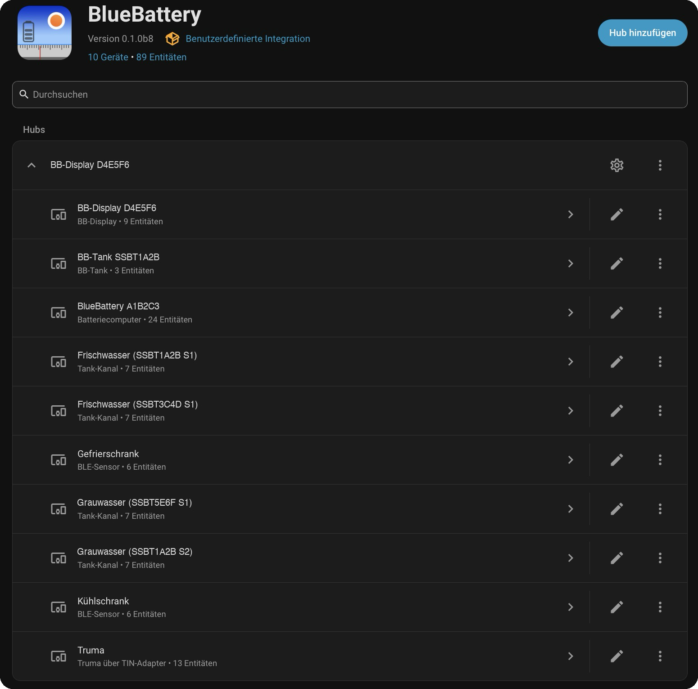

# Einrichtung Schritt für Schritt

🇩🇪 Deutsch | [🇬🇧 English](../en/setup.md) · [← zurück zur Übersicht](../../README.md)

Diese Anleitung führt dich vom BB-Display bis zur fertigen Integration. Jeder Schritt nennt den Weg über das Menü von Home Assistant. Dahinter steht oft ein Link **„Direkt öffnen ↗“**, der die passende Seite gleich öffnet.

> **„Direkt öffnen“** läuft über [my.home-assistant.io](https://my.home-assistant.io): Beim ersten Mal fragt die Seite einmalig nach der Adresse deines Home Assistant (z. B. `http://homeassistant.local:8123`) → eintragen → **Save**. Danach bestätigst du jeweils kurz mit **„Open link“** – eine Sicherheitsabfrage. Mehr dazu: [Wenn „Direkt öffnen“ nicht funktioniert](#wenn-direkt-öffnen-nicht-funktioniert).

**Inhalt**
- [Bevor du startest](#bevor-du-startest)
- [Schritt 1 – Geräte im BB-Display koppeln](#schritt-1--geräte-im-bb-display-koppeln)
- [Schritt 2 – Mosquitto-Broker installieren](#schritt-2--mosquitto-broker-installieren)
- [Schritt 3 – Benutzer für das Display anlegen](#schritt-3--benutzer-für-das-display-anlegen)
- [Schritt 4 – MQTT-Integration einrichten](#schritt-4--mqtt-integration-einrichten)
- [Schritt 5 – BB-Display mit Home Assistant verbinden](#schritt-5--bb-display-mit-home-assistant-verbinden)
- [Schritt 6 – BlueBattery über HACS installieren](#schritt-6--bluebattery-über-hacs-installieren)
- [Schritt 7 – BlueBattery einrichten](#schritt-7--bluebattery-einrichten)
- [Geräte später hinzufügen](#geräte-später-hinzufügen)
- [Wenn „Direkt öffnen“ nicht funktioniert](#wenn-direkt-öffnen-nicht-funktioniert)

---

## Bevor du startest

- **BB-Display** mit aktueller Firmware, im WLAN deines Fahrzeugs angemeldet ([Anleitung auf der Produktseite](https://www.blue-battery.com/product-page/bb-display)). Das Display nutzt **2,4-GHz-WLAN**.
- **Home Assistant** im selben Netz – am einfachsten **Home Assistant OS**, z. B. auf einem Raspberry Pi im Fahrzeug.
- **HACS** in Home Assistant ([so installierst du HACS](https://hacs.xyz/docs/use/)).
- **Internet** während der Einrichtung. Im Betrieb läuft alles lokal.

Home Assistant Container oder Core?

Dort gibt es keine Apps. Du brauchst einen eigenen MQTT-Broker (z. B. Mosquitto als Docker-Container) und richtest in Schritt 4 die MQTT-Integration mit dessen Adresse ein. Schritt 2 und 3 entfallen dann; Benutzer und Passwort legst du im Broker selbst an.

---

## Schritt 1 – Geräte im BB-Display koppeln

Home Assistant sieht nur, was das BB-Display kennt. Richte deshalb zuerst im Display (am Gerät bzw. in der Web-Oberfläche) alles ein, was du in Home Assistant haben möchtest:

- **Batteriecomputer** auswählen – das Display reicht genau einen weiter,
- **Tanksensoren** (BlueLevel/BlueLevel+, BB-Tank) koppeln und benennen,
- **Temperatursensoren** (Xiaomi LYWSD03MMC, RuuviTag) koppeln und benennen,
- **TIN-Adapter** anschließen und die Heizung einrichten.

Die Namen aus dem Display (z. B. „Frischwasser“, „Kühlschrank“) übernimmt die Integration.

---

## Schritt 2 – Mosquitto-Broker installieren

Der Broker ist die „Poststelle“, über die das BB-Display seine Daten an Home Assistant schickt. Mosquitto ist eine offizielle App und im App-Store bereits enthalten – du musst nichts hinzufügen.

**Im Menü:** Einstellungen → **Apps** → **App-Store** → „Mosquitto broker“ suchen. · [Direkt öffnen ↗](https://my.home-assistant.io/redirect/supervisor_addon/?addon=core_mosquitto)

1. **Installieren**.
2. **Starten** und **Beim Booten starten** sowie **Watchdog** einschalten.

<!-- 📷 TODO: images/01-mosquitto-app.png -->

---

## Schritt 3 – Benutzer für das Display anlegen

Das BB-Display meldet sich mit einem eigenen Benutzer am Broker an.

**Im Menü:** Einstellungen → **Personen**. · [Direkt öffnen ↗](https://my.home-assistant.io/redirect/people/)

1. **Person hinzufügen**.
2. Einen Namen vergeben (z. B. `BB-Display`) und **„Anmeldung erlauben“** einschalten.
3. **Benutzername** (z. B. `mqtt_user`) und ein **sicheres Passwort** festlegen – beides notieren, du brauchst es in Schritt 5.
4. **„Nur lokaler Zugriff“** einschalten, **kein Administrator** → **Erstellen**.

> Die Benutzernamen `homeassistant` und `addons` sind vom Mosquitto-Broker reserviert und funktionieren nicht. Deinen eigenen Home-Assistant-Zugang solltest du ebenfalls nicht verwenden.

<!-- 📷 TODO: images/02-mqtt-user.png -->

---

## Schritt 4 – MQTT-Integration einrichten

**Im Menü:** Einstellungen → **Geräte & Dienste** – meist erscheint **MQTT** schon unter „Entdeckt“ → **Konfigurieren** → bestätigen. Falls nicht: **Integration hinzufügen** → „MQTT“ → den Mosquitto-Broker auswählen. · [Direkt öffnen ↗](https://my.home-assistant.io/redirect/config_flow_start/?domain=mqtt)

<!-- 📷 TODO: images/03-mqtt-integration.png -->

---

## Schritt 5 – BB-Display mit Home Assistant verbinden

Öffne die Web-Oberfläche des Displays im Browser (die IP-Adresse findest du z. B. in der Geräteliste deines Routers) → **Einstellungen → Fernzugriff → MQTT**:

| Feld | Eintrag |
|---|---|
| Server | IP-Adresse deines Home Assistant (z. B. `192.168.1.10`) |
| Client ID | beliebig, z. B. `BBDisplay` |
| Port | `1883` |
| Benutzer / Passwort | aus Schritt 3 |
| Topic | Werkseinstellung lassen (`BlueBattery/BB-Display`) |
| Daten senden alle | `30` Sekunden |
| Home Assistant | **aus** – das übernimmt diese Integration |

Nach dem Speichern startet das Display neu. Oben in der Anzeige erscheint das Verbindungssymbol **⇄**.

> **Feste IP-Adresse:** Gib Home Assistant im Router eine feste IP-Adresse (DHCP-Reservierung). Ändert sich die Adresse, findet das Display den Broker sonst nicht mehr.

Anderes Topic verwenden?

Die Integration erkennt das BB-Display auch unter einem eigenen Topic (bis zu drei Ebenen, z. B. `camper/bb/display`). Empfohlen ist trotzdem die Werkseinstellung.

<!-- 📷 TODO: images/04-bb-display-mqtt.png -->

---

## Schritt 6 – BlueBattery über HACS installieren

Der Knopf öffnet BlueBattery direkt in HACS → **Herunterladen** → Home Assistant **neu starten** (Einstellungen → System → ⏻ → Home Assistant neu starten).

*Von Hand – Repository hinzufügen:*
1. **HACS** öffnen → **⋮** (oben rechts) → **Benutzerdefinierte Repositories**.
2. Repository: `https://github.com/sahomm/BlueBattery`, Typ: **Integration** → **Hinzufügen**.
3. In HACS nach **BlueBattery** suchen → **Herunterladen** → neueste Version bestätigen.
4. Home Assistant **neu starten**.

---

## Schritt 7 – BlueBattery einrichten

**Im Menü:** Einstellungen → **Geräte & Dienste** → unter „Entdeckt“ erscheint **BlueBattery – BB-Display** → **Konfigurieren**. · [Direkt öffnen ↗](https://my.home-assistant.io/redirect/config_flow_start/?domain=bluebattery)

1. Bestätigen – die Integration prüft kurz, ob das Display aktuelle Daten sendet (bis zu einer Minute).
2. **Geräte auswählen**, die übernommen werden sollen – angezeigt werden alle im Display gekoppelten Geräte.
3. **Fertig.** Jedes Gerät erscheint mit seinen Werten, das BB-Display ist das übergeordnete Gerät:

  

*Nicht unter „Entdeckt“?* → **Integration hinzufügen** → „BlueBattery“ → das Topic aus Schritt 5 eingeben. Siehe auch [Fragen & Antworten](faq.md).

**Wie geht es weiter?** Richte Benachrichtigungen, Frostschutz und mehr mit den [Praxisbeispielen](beispiele.md) ein.

---

## Geräte später hinzufügen

Neuer Tank, weiterer Temperatursensor, TIN-Adapter nachgerüstet?

1. Gerät **im BB-Display koppeln**.
2. Kurz warten – Home Assistant meldet unter **Einstellungen → Reparaturen**: *„Neues BlueBattery-Gerät gefunden“*.
3. **Einstellungen → Geräte & Dienste → BlueBattery → Konfigurieren** → neues Gerät anhaken → speichern.

- Vorhandene Geräte, Werte und ihr Verlauf bleiben unverändert.
- Ein abgewähltes Gerät wird nur **deaktiviert** (Verlauf bleibt); auf Wunsch kann es entfernt werden.
- Ist ein Gerät kurz außer Reichweite, wird es als **nicht verfügbar** angezeigt, aber nicht entfernt.

---

## Wenn „Direkt öffnen“ nicht funktioniert

Die Links „Direkt öffnen“ und der HACS-Knopf laufen über [my.home-assistant.io](https://my.home-assistant.io). Beim ersten Klick fragt die Seite nach der Adresse deines Home Assistant (z. B. `http://homeassistant.local:8123` oder `http://192.168.1.10:8123`) und merkt sie sich.

Typische Gründe, wenn es nicht klappt:
- Die gespeicherte Adresse stimmt nicht mehr → auf [my.home-assistant.io](https://my.home-assistant.io) unten „Change“ bzw. „Ändern“ und neu eintragen.
- Du hast den Link in der Home-Assistant-**App** geöffnet → stattdessen im **Browser** öffnen.
- Dein Handy ist gerade nicht im Netz des Fahrzeugs → mit dem Fahrzeug-WLAN verbinden.

Der Weg über das Menü führt immer zum selben Ziel.
